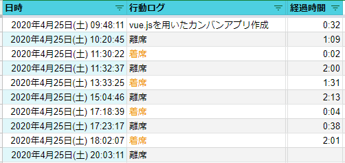

# 着席検知センサー

Raspberry Pi と人感センサーモジュールを使って、パソコン前に着席していることを検知するセンサーを作成。  
着席・離席を検知すると Google Apps Script を実行しスプレッドシートに記録する。  
スプレッドシートは検知した日時、行動ログ（着席 or 離席）を自動記録し、経過時間を算出する。行動ログは作業内容に書き換え可能。  

作業工数の自動集計を目的として作成したが、意思の弱いフリーランス在宅ワーカーの自分を自己監視する意味合いが強い。

# 使用機器

- Raspberry Pi2 Model B （2015 年 9 月購入のもの）
- Rasbee HC-SR501 人体赤外線感応モジュール
- ジャンパーワイヤ（メス-メス）
